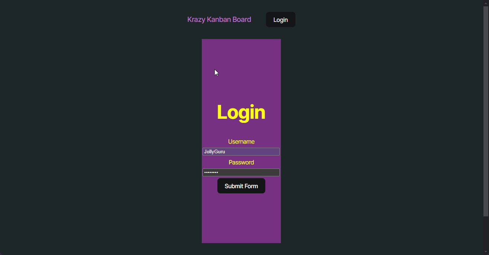
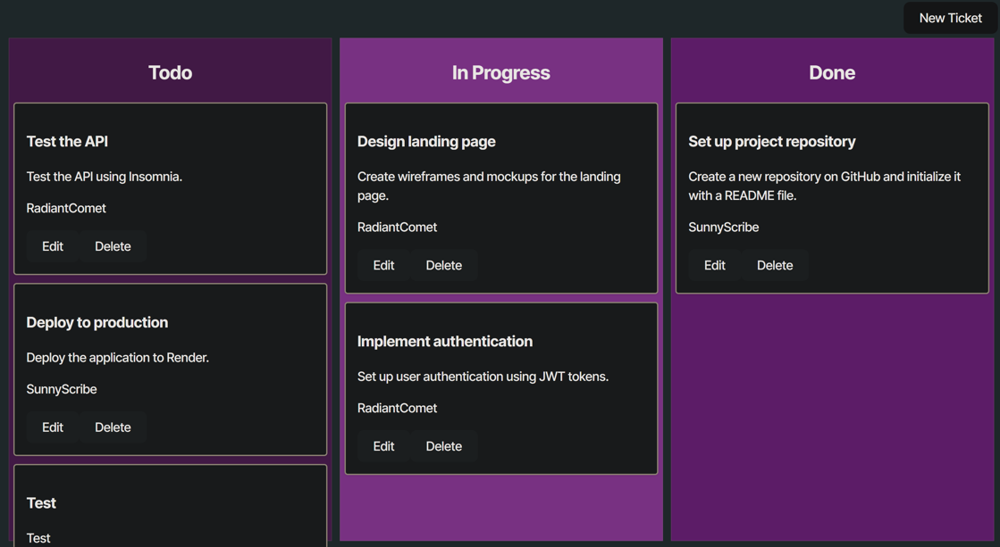

# [Kanban_board](https://kanbanboard-vpw9.onrender.com)


## Description

This project implements a Kanban board application with a secure user authentication system using JSON Web Tokens (JWT). The focus is on providing registered users with a seamless and secure experience for accessing and managing tasks. The application ensures that only authenticated users can interact with the Kanban board and that their sessions are securely maintained.

## Table of Contents
1. [Description](#description)
2. [Table of Contents](#table-of-contents)
3. [Usage](#usage)
4. [Installation](#installation)
5. [Demonstration](#demonstration)
6. [Technologies Employed](#technologies-employed)
7. [Future Development](#future-development)
8. [Contributing](#contributing)
9. [Credits](#credits)
10. [Tests](#tests)
11. [Questions](#questions)
12. [License](#license)

## Usage
**User Story:**
  ```md
  AS A registered user
  I WANT to authenticate using JSON Web Tokens (JWT)
  SO THAT I can securely access and manage my tasks on the Kanban board
  ```

**Acceptance Criteria:**
  ```md
  GIVEN a login page with form inputs for username and password
  WHEN I enter my valid username and password
  THEN I am authenticated using JSON Web Tokens (JWT) and redirected to the main Kanban board page
  WHEN I enter an invalid username or password
  THEN I am presented with an error message indicating that the credentials are incorrect
  WHEN I successfully log in
  THEN a JWT is stored securely in the client's local storage for subsequent authenticated requests
  WHEN I log out
  THEN the JWT is removed from the client's local storage and I am redirected to the login page
  WHEN I try to access the Kanban board page without being authenticated
  THEN I am redirected to the login page
  WHEN I remain inactive for a defined period
  THEN my session expires, the JWT is invalidated, and I am redirected to the login page upon my next action
  ```

## Key Features:
**Basic Functions:**
  * User Login: Please use a seeded, premade, user and password listed under 'Example Users'.
  * Create ticket: A user can create a ticket by clicking the "New Ticket" button.
  * Edit ticket: A user can click the "Edit" button on a specific ticket to edit all details. 
  * Delete ticket: Delete a specified ticket.
  * Filtering: Filter tickets by user.

**Example Users:** Use one of the following users to test and use the site.

| Username      | Password  |
| ------------- | --------- |
| JollyGuru     | password  |
| SunnyScribe   | password  |
| RadiantComet  | password  |


## Installation
No installation needed, the application is deployed using [Render Link](https://kanbanboard-vpw9.onrender.com).

## Demonstration
<div style="margin-left: 40px;">
  Demonstration of the application's desktop interface:<br/>
  
</div>
<br/>

<div style="margin-left: 40px;">
  Image of the application's desktop interface:<br/>
  
</div>
<br/>

## Technologies Employed

**Frontend:**  
 
 
  
 
 
 


**Backend:**  
   
    
   


**Authentication:**  
   

**Build:**  
   
   

## Future Development
I do not plan to make any further developments on this project outside of using it as a learning and rescoure model.

## Contributing
Contributions are welcome and encouraged. To do so:
- Fork this repository. 
- Your pull request will need approval in order to merge to ```main```.
- Take a look at the [Future Development](#future-development) section to see what I am currently working on.

## Credits
This code was written as an excersice by edX coding bootcamp and modified to function by me.

## Tests
No tests needed beyond visiting website.

## Questions
If you have any questions, please reach out to me at:
- Email: [skylarkline16@gmail.com](mailto:skylarkline16@gmail.com)
- GitHub: [skylark-shae](https://github.com/skylark-shae)

## License

This project is licensed under the MIT license.

The MIT License is a permissive software license originating at the Massachusetts Institute of Technology (MIT)[6] in the late 1980s.[7] As a permissive license, it puts very few restrictions on reuse and therefore has high license compatibility.

For more information visit [MIT Licensing](https://choosealicense.com/licenses/mit/).

- - -
© 2025 Sky-Shae Design. All Rights Reserved.
